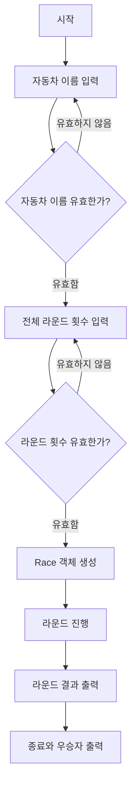

```mermaid
graph TD;
    start[시작]
    getCarNames[자동차 이름 입력]
    validateCarNames{자동차 이름 유효한가?}
    getTotalRounds[전체 라운드 횟수 입력]
    validateTotalRounds{라운드 횟수 유효한가?}
    race[Race 객체 생성]
    round[라운드 진행]
    displayRoundResult[라운드 결과 출력]
    finish[종료와 우승자 출력]

    start --> getCarNames
    getCarNames --> validateCarNames
    validateCarNames -- 유효함 --> getTotalRounds
    validateCarNames -- 유효하지 않음 --> getCarNames
    getTotalRounds --> validateTotalRounds
    validateTotalRounds -- 유효함 --> race
    validateTotalRounds -- 유효하지 않음 --> getTotalRounds
    race --> round
    round --> displayRoundResult
    displayRoundResult --> finish
```

